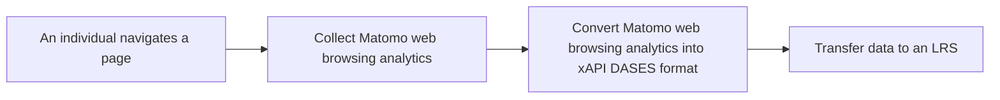

# Web Analytics Learning Records Universal Connector BB

Web Analytics Learning Records Universal Connector enables the conversion of web analytics data collected by Matomo, into an xAPI DASES format that can be stored and tracked in an Learning Record Store. This plugin seeks to promote data transactions within the Dataspace by providing a tool to facilitate the export of web analytics data from Matomo to the organizational LRS in the xAPI DASES standard. It ensures data interoperability to provide an overview of users' learning paths.

## Design Document
See the design document [here](docs/design-document.md).

## WALRUC Plugin Installation Guide

### Prerequisites

Before installing the WALRUC plugin, ensure you have:

- Matomo 5.2.0 or later installed
- PHP 8.2 or later
- Access to your Matomo server with administrator privileges
- A Learning Record Store (LRS) endpoint URL
- A basic auth url for your LRS
- Access to the Learning Record Converter (LRC) 

### Running instructions

1. Download the latest release
2. Extract the archive in a `Walruc` folder inside Matomo's `plugins` folder
3. Activate the plugin in the plug-in manager of your administration interface

### Configuration
1. Log in to Matomo administration interface
2. Navigate to Administration > Plugin Settings
3. Find "WALRUC" in the list
4. Configure the following settings:
    - LRS Endpoint URL
    - LRS basic auth
    - LRC link if hosted elsewhere than Inokufu

## Usage
As the plugin is not an API, there is no endpoint for use.
Once installed and configured, the WALRUC plugin works in total autonomy.
When an individual browses pages containing a Matomo configured with WALRUC, one (or more) traces will be visible in the target LRS.

