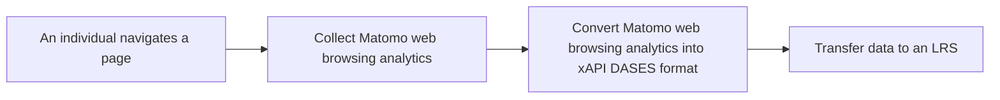

# Web Analytics Learning Records Universal Connector BB

Web Analytics Learning Records Universal Connector enables the conversion of web analytics data collected by Matomo, into an xAPI DASES format that can be stored and tracked in an Learning Record Store. This plugin seeks to promote data transactions within the Dataspace by providing a tool to facilitate the export of web analytics data from Matomo to the organizational LRS in the xAPI DASES standard. It ensures data interoperability to provide an overview of users' learning paths.

## Design Document
See the design document [here](docs/design-document.md).

## WALRUC Plugin Installation Guide

### Prerequisites

Before installing the WALRUC plugin, ensure you have:

- [Matomo 5.2.0 or later installed](https://github.com/matomo-org/matomo?tab=readme-ov-file)
- PHP 8.2 or later
- Access to your Matomo server with administrator privileges
- A Learning Record Store (LRS) endpoint POST URL (usually ending in /statements)
- A LRS basic auth
- Access to the Learning Record Converter (LRC)

### Running instructions

1. Download the latest release
2. Extract the archive in a `Walruc` folder inside Matomo's `plugins` folder
3. Activate the plugin in the plug-in manager of your administration interface

### Configuration
1. Log in to Matomo administration interface
2. Navigate to Administration > Plugin Settings
3. Find "WALRUC" in the list
4. Configure the following settings:
    - LRS Endpoint POST URL (usually ending in /statements)
    - LRS basic auth
    - LRC link if hosted elsewhere than Inokufu

#### Don't have an LRS ?
If you don't have an LRS, you can deploy Docker [LRSC](https://github.com/inokufu/lrsc), which deploys an LRS (Leaning Locker), a PDC and a connector between the two. 

If you don't have an LRS and don't want to deploy it, you can directly add the LRS of Inokufu : 
- URL : https://lrs.dataspace.inokufu.com/data/xAPI/statements  
- Basic auth : NjE0ODE1MWE2NDY4MjY3ZmVlMGQ3N2NkOTQzNDM3YzJiOWE3Y2E5YTowMzdlNTgxMmNhNjUzN2Y1OGU2ZjZkNGE2YjQxOWEyNmUyYmQzYjFh

## Usage
As the plugin is not an API, there is no endpoint for use.
Once installed and configured, the WALRUC plugin works in total autonomy.
When an individual browses pages containing a Matomo configured with WALRUC, one (or more) traces will be visible in the target LRS.


## Testing

### Setup test environment

Assuming Matomo and the WALRUC plugin are
already [installed and configured](https://developer.matomo.org/guides/tests-php), you can run the tests directly.

### Run tests

Matomo provides a convenient command-line tool called `console` that includes a built-in test runner.
From the Matomo root directory, you have to run :

```bash
./console tests:run Walruc
```

Matomo automatically configures and executes PHPUnit with the appropriate settings for the Matomo environment, and
formats the results.

### Test Summary

The test suite verifies several key components of the plugin.
The plugin uses proper dependency injection, making components easy to test in isolation.
The tests use mocks for external services (LRC and LRS), avoiding the need for actual endpoints during testing.

#### Request Processing

- Data extraction from Matomo requests (user, date, page, etc.) works as expected, even for missing information.
- End-to-end request processing flow functions correctly (conversion, storage).
- Errors during conversion or storage are properly handled and logged.

#### Data Handling

- Data validation correctly filters invalid inputs (negative timestamps, invalid IPs, malformed URLs).
- Special characters and Unicode are properly supported.
- IPv6 addresses are correctly handled.
- Various URL formats are properly validated.

#### HTTP Component

- The retry mechanism implements a robust error handling strategy that automatically retries failed HTTP requests.
- An exponential backoff algorithm increases the delay between retry attempts (e.g., waiting longer after each failure)
  to prevent overwhelming external services.
- The system preserves original error information throughout the retry process for proper debugging and logging.

### Final Assessment

No critical issues were identified during testing.
All tests pass, showing that:

- The HTTP communication layer handles network issues gracefully.
- The data extraction and validation logic works correctly.
- Error handling is properly implemented.
