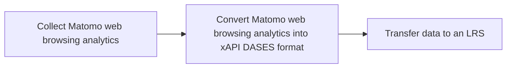
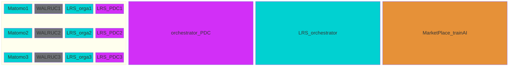
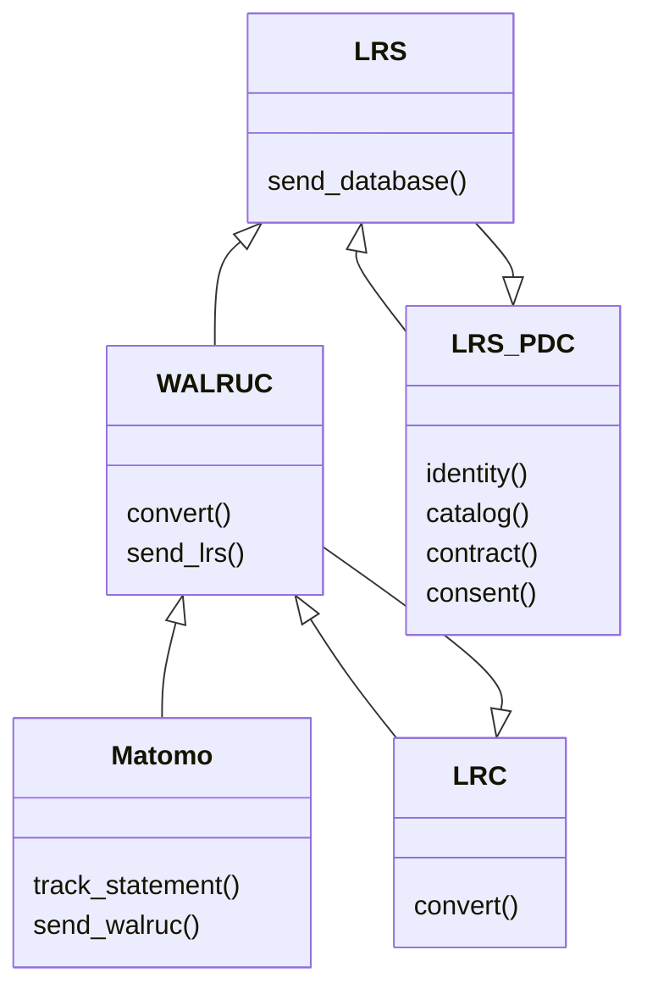
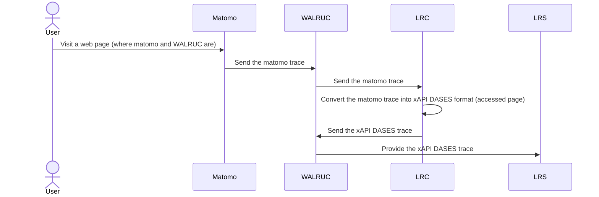

# Web Analytics Learning Records Universal Connector (WALRUC) BB – Design Document

Web Analytics Learning Records Universal Connector allows for the integration of web analytics data with a Learning Record Store (LRS) using the xAPI (Experience API) DASES standard. It enables the conversion of analytics data, such as the data collected by Matomo, into an xAPI format that can be stored and tracked in a LRS.

The WALRUC plugin plays a crucial role within the dataspace ecosystem, serving as a vital component that, despite its integral presence, does not engage in direct interaction with the dataspace itself. This design choice highlights the modular nature of the system, where each component has specialized functions.

For the WALRUC to effectively support its intended use cases, it must collaborate with a Learning Record Store (LRS). The LRS is the custodian of the WALRUC traces that will be shared in the dataspace. This connection from the LRS to the dataspace is established via a Prometheus-X Dataspace Connector (PDC), which ensures secure and efficient data transfer between components.

WALRUC's primary function is to generate xAPI traces from Matomo. These anonymized/pseudonymized traces are essential for training AI. In addition, WALRUC triggers data exchange, ensuring that relevant information is easily accessible and usable by converting the format.

However, it is important to note that while the WALRUC is deeply involved in data generation, the actual exchange of data with the data space itself is mediated by the LRS. This underlines the essential role of the LRS in the architecture, as a gateway for the flow of data in and out of the data space, thus maintaining a streamlined and organized data management system.

## Technical Choice

**LRS**

The Walruc Plugin will connect an account of Matomo Analytics with Learning Record Stores of the same organization in order to export web analytics data from Matomo. 

To perform our tests, we have deployed 1 LRS on [Learning Locker](https://learninglocker.atlassian.net/wiki/spaces/DOCS/overview).
Github link to deploy an LRS with Learning Locker : https://github.com/LearningLocker/deploy 

Please note that we are not making any changes to the LRS. The LRS just needs to be deployed for testing, but only the WALRUC extension is deliverable. The LRS will be deployed by each organization and will link the WALRUC extension to their matomo.


**Matomo**

[Matomo](https://fr.matomo.org/) is an open-source web analytics platform that offers detailed insights into website traffic and user behavior, serving as a powerful alternative to Google Analytics. Chosen for its strong focus on data privacy and compliance, Matomo ensures our deployment adheres to regulations like GDPR by providing tools for managing user consent and data. 

Matomo can be deployed in two ways, and for the purpose of strengthening the test instance of the plugin, Matomo Cloud and Matomo On-premise must be functional:
- Matomo Cloud: This is a managed service where Matomo handles the hosting and maintenance. It is recommended for ease of use and quick setup.
    - How to deploy Matomo Cloud? https://matomo.org/faq/videos/video-how-to-install-matomo-analytics-using-cloud-hosted/
- Matomo On-Premise: This option allows you to host Matomo on your own servers, giving you full control over the data and infrastructure.
    - How to deploy Matomo On-Premise? https://matomo.org/faq/on-premise/installing-matomo/

Please note that we are not making any changes to the Matomo. The Matomo just needs to be deployed for testing, but only the WALRUC extension is deliverable. The matomo will be deployed by each organization, and they will install the WALRUC plugin on it.

**Website**

As previously explained, Matomo will serve as the tool to collect web analytics data, which will then be transmitted to the organization's LRS through the Walruc plugin. For this purpose, three websites should be used as sources of navigation traces:
https://becomino.com/home
https://constellation.inokufu.com/
https://inokufu.com/ 
http://localhost:3000

For our tests, we will be using these sites because Inokufu owns them and has already deployed a matomo on them. But any site with a matomo can test WALRUC.

## Technical usage scenarios & Features

**Key functionalities:**

- WALRUC converts web browsing analytics data into xAPI DASES statement

**Value-added:**

- combining web browsing data and learning records

- track the overall engagement and effectiveness of learning website

- train IA

### Features/main functionalities

**Features**: 

- WALRUC converts web browsing analytics into xAPI DASES statement \
	Path:  \
		- "Matomo track web browsing analytics by data"\
		- "WALRUC (plugin of Matomo) converts web browsing analytics into xAPI DASES statement" \
		- "WALRUC sends xAPI DASES statement to LRS"




### Technical usage scenarios

A training organization can use WALRUC service to track and analyze the engagement and performance of their learners on their website. Here's an example of how this could work:

1. The training organization integrates their website with the web analytics tool Matomo, which tracks user interactions and engagement with the website.

2. The organization also sets up a Learning Record Store (LRS) like Learning Locker.

3. The WALRUC is implemented to connect the web analytics tool with the LRS. This allows the organization to convert the web  browsing analytics data into an xAPI DASES format that can be stored and tracked in the LRS.

4. As learners interact with the website, data is collected and tracked in the LRS. This includes information like pages viewed, time spent on the site, ...

5. The organization can use this data to track the performance of anonymized learners (or individual learners if they have their consent) and identify areas where they may need specific or additional support or resources.

6. The organization can also use the data to track the overall engagement and effectiveness of their website, and make improvements as needed.

## Requirements

| Requirement ID | Short description | BB input format | BB output format | Any other constraints | Verified by scenario | Requirement type |
|---|---|---|---|---|---|---|
| BB-REQ_ID__1 | The Matomo connected to WALRUC must ask users for consent to use their personal data | | |  |  |  |
| BB-REQ_ID__1.1 | WALRUC converts the data collected by matomo. If the data is anonymized then WALRUC processes the anonymized data. The same applies if the data is pseudonomized or clear | Matomo policies | Matomo settings | | BB-SC-WALRUC-01 | DEP |
| BB-REQ_ID__2 | WALRUC must be connected to an LRS | credential of LRS |  |  |  |  |
| BB-REQ_ID__2.1 | The organization's LRS must be connected to the dataspace | PDC | PDC | | BB-SC-WALRUC-02 | DEP |
| BB-REQ_ID__2.2 |WALRUC must send traces to LRS in less than 30 seconds (after receiving the converted trace) | xAPI | xAPI |  | BB-SC-WALRUC-03 | PERF |
| BB-REQ_ID__3 | WALRUC must be connected to BB LRC | call API | call API |  |  |  |
| BB-REQ_ID__3.1 | BB LRC (ARIANE project) must convert traces from WALRUC | matomo statement | xAPI DASES statement |  | BB-SC-WALRUC-04 | DEP |
| BB-REQ_ID__3.2 |WALRUC must send traces to LRC in less than 30 seconds (after receiving a matomo trace in WALRUC) | matomo statement  | xAPI DASES statement |  | BB-SC-WALRUC-05 | PERF |
| BB-REQ_ID__3.3 |LRC must send traces to WALRUC in less than 30 seconds (after conversion) | matomo statement  | xAPI DASES statement |  | BB-SC-WALRUC-06 | PERF |
| BB-REQ_ID__4 | WALRUC must be connected to Matomo |  |  |  |  |  |
| BB-REQ_ID__4.1 | Matomo must send traces to WALRUC in less than 30 seconds | matomo statement |matomo statement|  | BB-SC-WALRUC-07 | DEP |

## Integrations

### Direct Integrations with Other BBs

**Interact with Learning Records Store**

How?

- credentials of LRS in the WALRUC : source link and source basic auth

- synchronous

- xAPI format

Why?

- The LRS is the custodian of the WALRUC traces that will be shared in the dataspace.

**Interact with Learning Record Converter**

How?

- credentials of LRC in the WALRUC : Default in WALRUC installation file

- synchronous

- input : matomo statement

- output : xAPI DASES statement

Why?

- The LRC converts a trace from matomo format to xAPI DASES format

**Interact with Matomo**

How?

- HTTP request

- synchronous

- input/output : matomo statement

Why?

- Matomo sends web trace


## Relevant Standards

### Data Format Standards

**Data format:**

- The data produced and/or consumed are learning records. These are logs of learning activity done by a user.

- There are several standard formats for learning records (SCORM, xAPI, cmi5, IMS caliper).

- The consensus among experts is that xAPI is the most promising standard for describing learning records.

- Inokufu have published on Prometheus-X's github a state of the art study about learning records interoperability in 2023 (see here). This study describes the various formats and explains why “we" have selected xAPI as the defacto format for learning records for DASES (Dataspace of Education & Skills).

- In xAPI, each learning record is a json statement. This json contains several parts: actor, verb, object, result, context, timestamp.

- In order to perform the conversion, we will use the [xAPI DASES profile](https://github.com/gaia-x-dases/xapi-lms/tree/master), which has been specially designed for education.

- For an accessed page, data will be in xAPI format with the verb “https://w3id.org/xapi/netc/verbs/accessed”.


### Mapping to Data Space Reference Architecture Models



PDC : Prometheus-X Dataspace Connector
Each organization will generate metadata in its LRS, then send it to the LRS orchestrator for exchange in dataspace.

## Input / Output Data

**Input in matomo format**

Input and output data are in the same format: xAPI. 
For accessed page, data will be in xAPI format with the verb “https://w3id.org/xapi/netc/verbs/accessed”. 

As WALRUC is not an API, no BB other than LRS will need to send or receive data.

WALRUC uses [matomo data format](https://developer.matomo.org/guides/log-data) as input data format.

Here is an example of Matomo logs for a user who visited a page on http://localhost:3000/test.html

```json
{
    "siteName": "http://localhost:3000",
    "visitIp": "172.19.0.1",
    "user_id": null,
    "actionDetails": {
        "type": "action",
        "timestamp": 1733927799,
        "url": "http://localhost:3000/test.html",
        "title": "Test Matomo - Page test",
        "timeSpent": 4
    },
    "idVisit": 1,
    "visitorId": "7&k=",
    "languageCode": "fr-fr",
    "browserName": "CH",
    "countryCode": "fr",
    "regionCode": null,
    "city": null,
    "latitude": null,
    "longitude": null,
    "referrerKeyword": null,
    "referrerUrl": "",
    "interactions": 0,
    "location_ip": "\u0013\u0000\u0000",
    "visit_last_action_time": 1733927799,
    "visit_first_action_time": 1733925893,
    "visit_exit_idaction_url": 4,
    "visit_exit_idaction_name": 3,
    "visitor_returning": 0,
    "visitor_seconds_since_first": 0,
    "visitor_seconds_since_order": null,
    "visitor_count_visits": 1,
    "visit_goal_buyer": 0,
    "referer_name": null,
    "referer_type": 1,
    "idsite": "1",
    "profilable": 1,
    "visit_entry_idaction_url": 2,
    "visit_total_actions": "visit_total_actions + 1",
    "visit_total_interactions": "visit_total_interactions + 1",
    "visit_total_searches": 0,
    "config_client_type": 1,
    "config_device_brand": "",
    "config_device_model": "generic desktop",
    "config_device_type": 0,
    "visit_total_events": 0,
    "config_resolution": "1920x1080",
    "visit_total_time": 1907,
    "last_idlink_va": null,
    "custom_dimension_1": null,
    "custom_dimension_2": null,
    "custom_dimension_3": null,
    "custom_dimension_4": null,
    "custom_dimension_5": null,
    "time_spent_ref_action": 4,
    "action_name": "Test Matomo - Page test",
    "rec": "1",
    "r": "179197",
    "h": "15",
    "m": "36",
    "s": "39",
    "url": "http://localhost:3000/test.html",
    "_id": "89d6da37ae266b3d",
    "_idn": "0",
    "send_image": "0",
    "_refts": "0",
    "pv_id": "neds9i",
    "pf_net": "1",
    "pf_srv": "1",
    "pf_tfr": "2",
    "pf_dm1": "4",
    "uadata": {
        "formFactors": [
            "Desktop"
        ],
        "fullVersionList": [
            {
                "brand": "Chromium",
                "version": "131.0.6778.108"
            },
            {
                "brand": "Not_A Brand",
                "version": "24.0.0.0"
            }
        ],
        "mobile": false,
        "model": "",
        "platform": "Linux",
        "platformVersion": "6.8.0"
    },
    "pdf": "1",
    "qt": "0",
    "realp": "0",
    "wma": "0",
    "fla": "0",
    "java": "0",
    "ag": "0",
    "cookie": "1",
    "res": "1920x1080"
}
```

**Output in xAPI format**

To convert the given Matomo log example into an xAPI DASES statement, we will map the most relevant information from the log to the appropriate xAPI fields. This involves identifying the actor (the user), the verb (the action taken), and the object (the website accessed), as well as including relevant context where applicable.
For example, the matomo statement above breaks down into an xAPI DASES statement:

```json
"output_trace": {
		"timestamp": "2024-12-11T14:36:39+00:00",
		"actor": {
			"account": {
				"name": "7&k=",
				"homePage": "http://localhost:3000"
			},
			"objectType": "Agent"
		},
		"object": {
			"id": "http://localhost:3000/test.html",
			"definition": {
				"name": {
					"en-US": "Test Matomo - Page test"
				},
				"type": "https://w3id.org/xapi/acrossx/activities/webpage"
			}
		},
		"result": {
			"duration": "PT4S",
		},
		"context": {
			"language": "fr-fr",
			"extensions": {
				"http://id.tincanapi.com/extension/browser-info": {
					"name": "CH"
				},
				"http://id.tincanapi.com/extension/geojson": {
					"type": "Feature",
					"geometry": {
						"type": "Point"
					},
					"properties": {
						"countryCode": "fr"
					}
				},
				"http://id.tincanapi.com/extension/ip-address": "172.19.0.1",
				"http://id.tincanapi.com/extension/irl": "http://localhost:3000/test.html"
			},
			"contextActivities": {
				"category": [
					{
						"id": "https://w3id.org/xapi/lms",
						"definition": {
							"type": "http://adlnet.gov/expapi/activities/profile"
						}
					}
				]
			}
		},
		"verb": {
			"id": "https://w3id.org/xapi/netc/verbs/accessed",
			"display": {
				"en-US": "Accessed a page"
			}
		},
		"version": "1.0.0"
	},
	"recommendations": [
		{
			"rule": "presence",
			"path": "$.object.definition.extensions['https://w3id.org/xapi/acrossx/extensions/type']",
			"expected": "included",
			"actual": "missing"
		},
		{
			"rule": "any",
			"path": "$.object.definition.extensions['https://w3id.org/xapi/acrossx/extensions/type']",
			"expected": [
				"course",
				"course_list",
				"user_space"
			],
			"actual": []
		}
	],
	"meta": {
		"input_format": "matomo",
		"output_format": "xapi",
		"profile": "lms.accessed-page"
	}

```


## Architecture

PDC : Prometheus-X Dataspace Connector

Dynamic Behaviour
WALRUC building blocks communicate with other building blocks, in a precise order.

PDC : Prometheus-X Dataspace Connector

## Configuration and deployment settings

**Installation**

The organization must :

- Install Matomo 5.2.0 or later on a server

- Deploy an LRS (learning locker for example)

- Install WALRUC plugin on Matomo

**Settings**

The organization must :
- Matomo
 - Connect a website to Matomo
 - Indicate in matomo's legal notice that the user will be tracked

- LRS
 - Create a store in LRS
 - Create a client associate to the store in LRS
 - Give write access to the client
 - Connect the PDC to the LRS
 - Sign the contract with the WALRUC offer

- WALRUC
 - Fill in the LRS link : url of xAPI Endpoint and Basic Auth

### Error Scenarios Defined

The idea of the risk table is to define the probable causes of failure in order to estimate the probability of encountering this failure, to evaluate its secondary effects and therefore to plan preventive or corrective actions.


We will assign 3 scores on a scale of 1 to 10 to potential failures:

- **Detection** (risk of non-detection)

- **Occurrence** (probable occurrence, frequency of occurrence)

- **Severity of Effect** (consequences for the customer)


Criticality is calculated as follows:

`criticality = detection x occurrence x severity`


If criticality is greater than 10, then preventive action must be taken. If not, no action is required.
  

| ID  | Function involved| Description of risk | Effect of failure | Cause of failure | Evaluation - Detection | Evaluation - Occurrence | Evaluation - Severity | Evaluation - Criticality | Preventive actions |
| --- | --- | --- | --- | --- | --- | --- | --- | --- | --- |
| Error-Scenario_1   | export web analytics data from Matomo to LRS| Data may be lost when sending to LRS| The organization doesn't receive the complete statements in its LRS| Incorrect connection between Walruc and LRS| 2| 2| 9| 36|Exponential dispatch call  | 
| Error-Scenario_2   | export web analytics data from Matomo to LRS| Data may be lost when sending to LRC| Impossible to convert| API temporarily unavailable| 2| 2| 9| 36|Exponential dispatch call  | 
| Error-Scenario_3   | export web analytics data from Matomo to LRS| The same data can be exported several times|Export several times| Duplicate dat|1|2|4| 8||
| Error-Scenario_4   | export web analytics data from Matomo to LRS| The organization may decide to change its LRS| Reconnecting Matomo-plugin and the new LRS | Change of LRS/LMS | 1| 2| 1| 2|| 
| Error-Scenario_5   | Convert Matomo trace into xAPI DASES format| The Matomo trace settings do not match the requested settings. | Impossible to convert| Not same settings | 2| 3| 7| 42| Set up a parameter sheet          

## Third Party Components & Licenses

**External components and licenses :**

- Matomo, [open source](https://github.com/matomo-org/matomo), [license ](https://fr.matomo.org/licences/)[GPLv3](https://fr.matomo.org/licences/)

- Pydantic, [open source](https://github.com/pydantic/pydantic), [license MIT](https://github.com/pydantic/pydantic?tab=MIT-1-ov-file#readme)


## OpenAPI Specification

The WALRUC code has no API. In fact, data exchange is generated by the LRS, when an individual submits an edit or review. This data is stored in a third-party LRS, which itself has an API. In our case, we use the LRS learning locker. API calls are generic to all LRSs.

[The OpenAPI specification for an LRS is available here.](https://github.com/Prometheus-X-association/walruc/blob/main/docs/openapi.yml)

## Codebase : Mockup version
To get a functional understanding of this mockup and see some sample traces, go [here](https://github.com/Prometheus-X-association/walruc/blob/main/docs/Mockup%20Walruc.md).

To have a write access to the traces make a request on this [mockup document](https://docs.google.com/document/d/1DwXxVtfRkWuW_jwCQBVjJ2eYNImKd3HI8f0f4iQYyi8/edit).
To have a read access to the traces make a request on this [mockup document](https://docs.google.com/document/d/12ZXHjXoZ5jNAhmsdc0IPs6e-oJAG6zCzdDe5awPe1_I/edit).

As explained above, the WALRUC code does not include any APIs, so there is no such thing as a dummy code. The only codebase used is that of the LRS with the /PUT /POST and /GET endpoints.

### PUT
description: Store a single statement as a single member of a set.

### POST
description: "Store a set of statements (or a single statement as a single member of a set).

### GET
description: Read a single xAPI Statement or multiple xAPI Statements.

[Answer API of Learning Locker](https://learninglocker.atlassian.net/wiki/spaces/DOCS/pages/106463240/Rest+API)

## First version
A first version of WALRUC has been deployed. Its purpose is to validate the functionalities mentioned in this design document. The “dataspace integration” part will be fine-tuned later”. Nevertheless, the principle is the same for this extension.

The Walruc plugin is triggered when a visit is made to the site and works as follows:
- Retrieves formatted information about the visit: HTTP request, visitor, site visited;
- Sending data to the LRC for conversion into xAPI DASES;
- Receipt of trace in xAPI DASES format;
- Sending converted data to the LRS.

Insofar as WALRUC makes calls to external APIs (the LRC and LRS), services may be temporarily unavailable for various reasons. For this reason, an exponential backoff system has been implemented, i.e. if an HTTP call fails, it is retried, if necessary several times, with an increasingly long delay between each attempt and a maximum number of attempts.

#### WALRUC Plugin Installation Guide

##### Prerequisites

Before installing the WALRUC plugin, ensure you have:

- Matomo 5.2.0 or later installed
- PHP 8.2 or later
- Access to your Matomo server with administrator privileges
- A Learning Record Store (LRS) endpoint POST URL (usually ending in /statements)
- A LRS basic auth
- Access to the Learning Record Converter (LRC)

##### Running instructions

1. Download the latest release
2. Extract the archive in a `Walruc` folder inside Matomo's `plugins` folder
3. Activate the plugin in the plug-in manager of your administration interface

##### Configuration
1. Log in to Matomo administration interface
2. Navigate to Administration > Plugin Settings
3. Find "WALRUC" in the list
4. Configure the following settings:
    - LRS Endpoint POST URL (usually ending in /statements)
    - LRS basic auth
    - LRC link if hosted elsewhere than Inokufu
  
If you don’t have an LRS you can use the WALRUC Client LRS : 
- URL : https://lrs.dataspace.inokufu.com/data/xAPI/statements  
- Basic auth : NjE0ODE1MWE2NDY4MjY3ZmVlMGQ3N2NkOTQzNDM3YzJiOWE3Y2E5YTowMzdlNTgxMmNhNjUzN2Y1OGU2ZjZkNGE2YjQxOWEyNmUyYmQzYjFh


## Test specification

The Web Analytics Learning Record Universal Connector tests ensure that :
- functionality is efficient
- potential risks are under control
- users are satisfied

### Test

The Walruc testing strategy will focus on ensuring the accuracy, reliability and performance of its functionality. We will use a combination of unit testing, integration testing and user interface testing. The test environment will reproduce conditions similar to those in production in order to accurately validate BB behavior. Acceptance criteria will be defined on the basis of user stories, functional requirements and performance criteria.

**Methodology**

Summary of test :
- Validate requirements and potential risks
- Manual Usage Scenario
- Unit test

For our test we will use : 
- website connected to the Matomo : https://becomino.com/
- LRS : https://lrs.dataspace.inokufu.com/data/xAPI/statements, basic auth NjE0ODE1MWE2NDY4MjY3ZmVlMGQ3N2NkOTQzNDM3YzJiOWE3Y2E5YTowMzdlNTgxMmNhNjUzN2Y1OGU2ZjZkNGE2YjQxOWEyNmUyYmQzYjFh
- the personas, user stories, userflow and dataflow from the Wiki LOM use case

The tests will be conclusive if we see the traces appear on Learning Locker.

### Validate requirements and potential risks
Tests to validate requirements and potential risks.

| Verified by scenario| Description | Prerequisites | Test | Status |
|---|---|---|---|---|
| BB-SC-WALRUC-01 | WALRUC converts the data collected by matomo. If the data is anonymized then WALRUC processes the anonymized data. The same applies if the data is pseudonomized or clear| The WALRUC plugin is installed and configured. Access to the target LRS is required. | Check whether the state of the input trace is the same as that of the output trace (anonymized, pseudonymized, clear) |  Validated |
| BB-SC-WALRUC-02 | The organization's LRS must be connected to the dataspace | The WALRUC plugin is installed and configured. Access to the target LRS is required. LRS of organization not connected to the PDC and not involved in the use case. | Try data exchange in dataspace without a PDC | Not yet tested |
| BB-SC-WALRUC-03 | WALRUC must send traces to LRS in less than 30 seconds (after receiving the converted trace) | The WALRUC plugin is installed and configured. Access to the target LRS is required. | Average send time < 30 seconds| Validated|
| BB-SC-WALRUC-04 |BB LRC (ARIANE project) must convert traces from WALRUC | The WALRUC plugin is installed and configured. Access to the target LRS is required.  | Send a dataset for conversion  | Validated : no error message |
| BB-SC-WALRUC-05 | WALRUC must send traces to LRC in less than 30 seconds (after receiving a matomo trace in WALRUC) | The WALRUC plugin is installed and configured. Access to the target LRS is required.  | Average send time < 30 seconds | Validated|
| BB-SC-WALRUC-06 | LRC must send traces to WALRUC in less than 30 seconds (after conversion) | The WALRUC plugin is installed and configured. Access to the target LRS is required. | Average send time < 30 seconds | Validated|
| BB-SC-WALRUC-07 | Matomo must send traces to WALRUC in less than 30 seconds | The WALRUC plugin is installed and configured. Access to the target LRS is required. | Average send time < 30 seconds | Validated|
| Error-Scenario_1 | Data may be lost when sending to LRS | The WALRUC plugin is installed and configured. Access to the target LRS is required.  | Check the declarations visible in the associated LRS | Validated |
| Error-Scenario_2 | Data may be lost when sending to LRC | The WALRUC plugin is installed and configured. Access to the target LRS is required. | Check the declarations visible in the associated LRS | Validated |
| Error-Scenario_3 | The LRS doesn't have enough storage space for all statements | The WALRUC plugin is installed and configured. Access to the target LRS is required. | Check the storage of Matomo and associated LRS | Not yet tested |
| Error-Scenario_5 | The Matomo trace settings do not match the requested settings | The WALRUC plugin is installed and configured. Access to the target LRS is required. |  Check the declarations visible in the associated LRS, for a non-matching trace | Validated : error message |


### Manual usage scenario
Several manual tests of the same type (visiting several pages of a website) are carried out.

Persona 1 : kylian (Learner)
Persona 2 : mmedupont (LRS admin)

Scenario :
On February 4, 2025, Kylian visits page https://becomino.com at 10:51 am for 77 seconds, then page https://becomino.com/board/valorisation-batiment-1701336809956x653082361463832600 for 8 seconds, then page https://becomino.com/category/economie-circulaire for 36 seconds.
The WALRUC extension is connected to mmedupont's LRS.

Validation : the scenario is validated if it appears in mmedupont's LRS under 3 traces :
- Kylian visited https://becomino.com/home on February 4, 2025 at 10:51 am for 77 seconds
- Kylian visited https://becomino.com/category/sante on February 4, 2025 for 8 seconds
- Kylian visited https://becomino.com/board/devenir-pro-prothese-dentaire-1641214891192x269783012203036670 on February 4, 2025 for 36 seconds

Kylian is pseudonomized as `k)'3`.

First statement :


### Unit tests
We performed unit tests on the entire flow. [Here are all the tests](https://github.com/Prometheus-X-association/walruc/tree/main/tests).

Thanks to our unit tests, we were able to prove these next elements.

For the “Visit information formatting recovery” section:
- For a visit whose information is fixed by the test (Ip, date, page, etc.), the formatting must generate the data in a form also fixed by the test.
- For a visit where some information is missing, the data must be generated correctly.
- For a visit with incorrect information (negative dates, invalid IP, invalid URL), the process should send an error.
- Information such as IP in v6 format, accented characters or URLs in exotic formats must be taken into account.

For the parts concerning HTTP calls to the LRC or LRS:
- LRC : role of LRC-side tests.
- The exponential backoff is triggered in the event of an error, so that if the maximum number of trials is reached, this is indicated by an error, and the delays between each trial are respected.

Tests are carried out on the entire process:
- When there is a visit, the conversion method must be called once, then the storage method once.
- If the conversion method returns an error, logs are written.
- If the store method returns an error, logs must be written.

## Partners & roles
[Inokufu](https://www.inokufu.com/) (BB leader): 
- Organize workshops
- Develop the BB
- Test the BB

## Usage in the dataspace
The WALRUC will be used as a potential source of data for a LRS and thus be part of the service chains:

- Personal learning record: Sharing LMS/Moodle Data for Visualization
  
.png)
PDC: Prometheus-X Dataspace Connector

- Decentralized AI training: Training of trustworthy AI models
