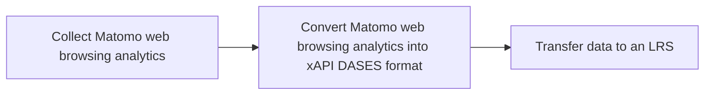
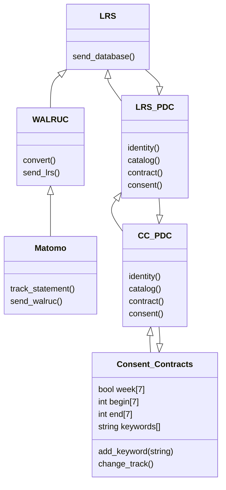
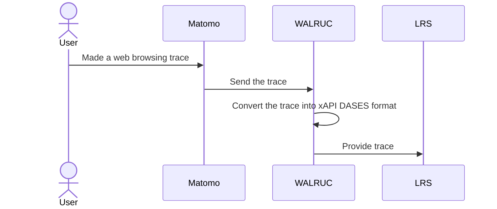

# Web Analytics Learning Records Universal Connector (WALRUC) BB – Design Document

Web Analytics Learning Records Universal Connector allows for the integration of web analytics data with a Learning Record Store (LRS) using the xAPI (Experience API) DASES standard. It enables the conversion of analytics data, such as the data collected by Matomo, into an xAPI format that can be stored and tracked in a LRS.

## Technical usage scenarios & Features

**Key functionalities:**

- WALRUC converts web browsing analytics data into xAPI DASES statement

**Value-added:**

- combining web browsing data and learning records

- track the overall engagement and effectiveness of learning website

### Features/main functionalities

**Features**: 

- WALRUC converts web browsing analytics into xAPI DASES statement \
	Path:  \
		- "Matomo track web browsing analytics by data"\
		- "WALRUC (plugin of Matomo) converts web browsing analytics into xAPI DASES statement" \
		- "WALRUC sends xAPI DASES statement to LRS"




### Technical usage scenarios

A training organization can use WALRUC service to track and analyze the engagement and performance of their learners on their website. Here's an example of how this could work:

1. The training organization integrates their website with the web analytics tool Matomo, which tracks user interactions and engagement with the website.

2. The organization also sets up a Learning Record Store (LRS) like Learning Locker.

3. The WALRUC is implemented to connect the web analytics tool with the LRS. This allows the organization to convert the web  browsing analytics data into an xAPI DASES format that can be stored and tracked in the LRS.

4. As learners interact with the website, data is collected and tracked in the LRS. This includes information like pages viewed, time spent on the site, ...

5. The organization can use this data to track the performance of anonymized learners (or individual learners if they have their consent) and identify areas where they may need specific or additional support or resources.

6. The organization can also use the data to track the overall engagement and effectiveness of their website, and make improvements as needed.

## Requirements

| Requirement ID | Short description | BB input format | BB output format | Any other constraints | Verified by scenario | Requirement type |
|---|---|---|---|---|---|---|
| BB-REQ_ID__1 | WALRUC must request building block consent via the Prometheus-X Dataspace Connector | API call | API response |  |  |  |
| BB-REQ_ID__1.1 | Individuals must consent to the use and export of their web analytics data as learning records in the WALRUC plugin of the organization | API call | API response | If the answer is no, the data cannot be used, nor transferred into or from the WALRUC. If the answer is yer, the data can be used, and transferred into or from the WALRUC. | BB-SC-WALRUC-01 | DEP |
| BB-REQ_ID__1.2 | Consent must be asked and verified in less than 30s | API call | API response |  | BB-SC-WALRUC-02 | PERF |
| BB-REQ_ID__2 | WALRUC must request contracts from the building block consent via the Prometheus-X Dataspace Connector | API call | API response |  |  |  |
| BB-REQ_ID__2.1 | The WALRUC must check with the contract manager through the Dataspace connector if a contract for the corresponding organization exists | API call | API response | If the answer is no, the data cannot be accessed, nor transferred into or from the PLRS. If the answer is yer, the data can be accessed, and transferred into or from the PLRS. | BB-SC-WALRUC-03 | DEP |
| BB-REQ_ID__2.2 | Contract must be asked and verified in less than 30s | API call | API response |  | BB-SC-WALRUC-04 | PERF |
| BB-REQ_ID__3 | WALRUC must connect with BB Consent/contracts negotiating agent (EDGE-Skill) |  |  |  |  |  |
| BB-REQ_ID__3.1 | BB must send the individual's consent profile when the WALRUC asks to adjust what and when they are tracked: all-time connection, only on weekends, certain keywords, etc. | API call | consent profile | Request consent 1 time, then update if the profile is modified in the corresponding building bloc. Could be asynchronous | BB-SC-WALRUC-05 | DEP |
| BB-REQ_ID__3.2 | BB must update the individual's consent profile to WALRUC when there are changes | consent profile | / | update if the profile is modified in the corresponding building bloc. Could be asynchronous | BB-SC-WALRUC-06 | DEP |

## Integrations

### Direct Integrations with Other BBs

**Interact with consent/contract**

How?

- Identify data import period (date, time, week)

- Identify keywords where we can import

- Identify sites where we can import

Why?

- transparency on data transfer

### Integrations via Connector

**Connection with connector:**

Why?

- Simplify communication between the WALRUC and PTX CCs

**Connection with contract:** 

Why?

- Contract between LRS supplier and the organization

**Connection with consent:**

Why?

- user consent to export/import his web browsing traces

What?

- Obtain user consent to export web browsing traces

- Obtain the user's consent to share web browsing traces with an LRS

**Connection with identity:**

Why?

- Enable WALRUC to use users' identities to display metadata with other

What?

- Use the user's first and last name

- Use the user's professional background

- Use the user's educational background

## Relevant Standards

### Data Format Standards

**Data format:**

- the data produced and/or consumed are learning records. These are logs of learning activity done by a user.

- There are several standard formats for learning records (SCORM, xAPI, cmi5, IMS caliper).

- The consensus among experts is that xAPI is the most promising standard for describing learning records.

- Inokufu have published on Prometheus-X's github a state of the art study about learning records interoperability in 2023 (see [here](https://github.com/Prometheus-X-association/learning-records-interoperability-2023)). This study describes the various formats and explains why “we" have selected xAPI as the defacto format for learning records for DASES (Dataspace of Education & Skills).

- In xAPI, each learning record is a json statement. This json contains several parts: actor, verb, object, result, context, timestamp.

- The most critical personal data are in general in the actor part. According to xAPI, one can use first name, last name or email as the actor identifier. However, in our case we always recommend using uuid to identify actors. This way our learning records are pseudonymized by default. As this won’t always be the case with other organizations connected to the dataspace.

- In order to perform the conversion, we will use the [xAPI DASES profile](https://github.com/gaia-x-dases/xapi-lms/tree/master), which has been specially designed for education.

### Mapping to Data Space Reference Architecture Models


PDC : Prometheus-X Dataspace Connector

## Input / Output Data

**Input in matomo format**

WALRUC uses [matomo data format](https://developer.matomo.org/guides/log-data) as input data format.

Here is an example of Matomo logs for a user who visited 3 pages on www.inokufu.com

```json
{
    "idSite": "1",
    "idVisit": "68536",
    "visitIp": "12.123.0.0",
    "visitorId": "abcdefg",
    "fingerprint": "hijklmnop",
    "actionDetails": [
{
        "type": "action",
        "url": "https://www.inokufu.com/",
        "pageTitle": "Inokufu | Better data for better learning",
        "pageIdAction": "2",
        "idpageview": "CWrLQ5",
        "serverTimePretty": "4 juil. 2024 18:43:05",
        "pageId": "182005",
        "timeSpent": 8,
        "timeSpentPretty": "8s",
        "pageviewPosition": "1",
        "title": "Inokufu | Better data for better learning",
        "subtitle": "https://www.inokufu.com/",
        "icon": "",
        "iconSVG": "plugins/Morpheus/images/action.svg",
        "timestamp": 1720118585
      },
      {
        "type": "action",
        "url": "https://www.inokufu.com/learning-platform/",
        "pageTitle": "Learning platform | Inokufu",
        "pageIdAction": "4715",
        "idpageview": "iTnAa1",
        "serverTimePretty": "4 juil. 2024 18:43:13",
        "pageId": "182006",
        "timeSpent": 24,
        "timeSpentPretty": "24s",
        "pageviewPosition": "2",
        "title": "Learning platform | Inokufu",
        "subtitle": "https://www.inokufu.com/learning-platform/",
        "icon": "",
        "iconSVG": "plugins/Morpheus/images/action.svg",
        "timestamp": 1720118593
      },
      {
        "type": "action",
        "url": "https://www.inokufu.com/search-engine/",
        "pageTitle": "Search Engine | Inokufu",
        "pageIdAction": "4710",
        "idpageview": "2vf6wq",
        "serverTimePretty": "4 juil. 2024 18:43:37",
        "pageId": "182007",
        "timeSpent": 0,
        "timeSpentPretty": "0s",
        "pageviewPosition": "3",
        "title": "Search Engine | Inokufu",
        "subtitle": "https://www.inokufu.com/search-engine/",
        "icon": "",
        "iconSVG": "plugins/Morpheus/images/action.svg",
        "timestamp": 1720118617
      }
    ],
    "goalConversions": 0,
    "siteCurrency": "EUR",
    "siteCurrencySymbol": "€",
    "serverDate": "2024-07-04",
    "visitServerHour": "16",
    "lastActionTimestamp": 1720111417,
    "lastActionDateTime": "2024-07-04 16:43:37",
    "siteName": "www.inokufu.com",
    "serverTimestamp": 1720111417,
    "firstActionTimestamp": 1720111385,
    "serverTimePretty": "18:43:37",
    "serverDatePretty": "Jeudi 4 juillet 2024",
    "serverDatePrettyFirstAction": "Jeudi 4 juillet 2024",
    "serverTimePrettyFirstAction": "18:43:05",
    "userId": null,
    "visitorType": "new",
    "visitorTypeIcon": null,
    "visitConverted": "0",
    "visitConvertedIcon": null,
    "visitCount": "1",
    "visitEcommerceStatus": "none",
    "visitEcommerceStatusIcon": null,
    "daysSinceFirstVisit": 0,
    "secondsSinceFirstVisit": "0",
    "daysSinceLastEcommerceOrder": 0,
    "secondsSinceLastEcommerceOrder": null,
    "visitDuration": "33",
    "visitDurationPretty": "33s",
    "searches": "0",
    "actions": "3",
    "interactions": "3",
    "referrerType": "search",
    "referrerTypeName": "Moteurs de recherche",
    "referrerName": "Google",
    "referrerKeyword": "Mot clef indéfini",
    "referrerKeywordPosition": null,
    "referrerUrl": "https://www.google.com/",
    "referrerSearchEngineUrl": "http://google.com",
    "referrerSearchEngineIcon": "plugins/Morpheus/icons/dist/searchEngines/google.com.png",
    "referrerSocialNetworkUrl": null,
    "referrerSocialNetworkIcon": null,
    "languageCode": "fr-fr",
    "language": "Code langue fr-fr",
    "deviceType": "Bureau",
    "deviceTypeIcon": "plugins/Morpheus/icons/dist/devices/desktop.png",
    "deviceBrand": "Apple",
    "deviceModel": "Générique Bureau",
    "operatingSystem": "Mac 10.15",
    "operatingSystemName": "Mac",
    "operatingSystemIcon": "plugins/Morpheus/icons/dist/os/MAC.png",
    "operatingSystemCode": "MAC",
    "operatingSystemVersion": "10.15",
    "browserFamily": "Blink",
    "browserFamilyDescription": "Blink (Chrome, Opera)",
    "browser": "Chrome 126.0",
    "browserName": "Chrome",
    "browserIcon": "plugins/Morpheus/icons/dist/browsers/CH.png",
    "browserCode": "CH",
    "browserVersion": "126.0",
    "events": "0",
    "continent": "Europe",
    "continentCode": "eur",
    "country": "France",
    "countryCode": "fr",
    "countryFlag": "plugins/Morpheus/icons/dist/flags/fr.png",
    "region": "Île-de-France",
    "regionCode": "IDF",
    "city": "Bezons",
    "location": "Bezons, Île-de-France, France",
    "latitude": "48.924000",
    "longitude": "2.213000",
    "visitLocalTime": "18:43:05",
    "visitLocalHour": "18",
    "daysSinceLastVisit": 0,
    "secondsSinceLastVisit": "0",
    "resolution": "1440x900",
    "plugins": "cookie, pdf",
    "pluginsIcons": [
      {
        "pluginIcon": "plugins/Morpheus/icons/dist/plugins/cookie.png",
        "pluginName": "cookie"
      },
      {
        "pluginIcon": "plugins/Morpheus/icons/dist/plugins/pdf.png",
        "pluginName": "pdf"
      }
    ]
  }

```

**Output in xAPI format**

To convert the given Matomo log example into an xAPI DASES statement, we will map the most relevant information from the log to the appropriate xAPI fields. This involves identifying the actor (the user), the verb (the action taken), and the object (the website ccessed), as well as including relevant context where applicable.
For example, the matomo statement above breaks down into 3 xAPI DASES statements:

```json

{
   "actor": {
      "account": {
         "name": "abcdefg",
         "homePage": "https://www.inokufu.com/"
      }
   },
   "verb": {
      "id": "https://w3id.org/xapi/netc/verbs/accessed"
   },
   "object": {
      "objectType": "Activity",
      "id": "https://www.inokufu.com/",
      "definition": {
         "type": "https://w3id.org/xapi/acrossx/activities/webpage",
         "name": {
            "en": "Inokufu | Better data for better learning"
         },
         "extensions": {
            "https://w3id.org/xapi/acrossx/extensions/type": "website"
         }
      }
   },
   "context": {
      "contextActivities": {
         "category": [
            {
               "id": "homepage",
               "definition": {
                  "type": "http://adlnet.gov/expapi/activities/profile"
               }
            }
         ]
      }
         "extensions": {
            "http://id.tincanapi.com/extension/duration": "8s",
            "http://id.tincanapi.com/extension/browser-info": "Chrome 126.0"
         }
   }
   "timestamp": "2024-07-04T18:43:05.887Z"
}
```

```json

{
   "actor": {
      "account": {
         "name": "abcdefg",
         "homePage": "https://www.inokufu.com/"
      }
   },
   "verb": {
      "id": "https://w3id.org/xapi/netc/verbs/accessed"
   },
   "object": {
      "objectType": "Activity",
      "id": "https://www.inokufu.com/learning-platform/",
      "definition": {
         "type": "https://w3id.org/xapi/acrossx/activities/webpage",
         "name": {
            "en": "Learning platform | Inokufu"
         },
         "extensions": {
            "https://w3id.org/xapi/acrossx/extensions/type": "website"
         }
      }
   },
   "context": {
      "contextActivities": {
         "category": [
            {
               "id": "https://w3id.org/xapi/lms",
               "definition": {
                  "type": "http://adlnet.gov/expapi/activities/profile"
               }
            }
         ]
      }
         "extensions": {
            "http://id.tincanapi.com/extension/duration": "24s",
            "http://id.tincanapi.com/extension/browser-info": "Chrome 126.0"
         }
   }
   "timestamp": "2024-07-04T18:43:13.887Z"
}
```

```json

{
   "actor": {
      "account": {
         "name": "abcdefg",
         "homePage": "https://www.inokufu.com/"
      }
   },
   "verb": {
      "id": "https://w3id.org/xapi/netc/verbs/accessed"
   },
   "object": {
      "objectType": "Activity",
      "id": "https://www.inokufu.com/search-engine/",
      "definition": {
         "type": "https://w3id.org/xapi/acrossx/activities/webpage",
         "name": {
            "en": "Search Engin | Inokufu"
         },
         "extensions": {
            "https://w3id.org/xapi/acrossx/extensions/type": "website"
         }
      }
   },
   "context": {
      "contextActivities": {
         "category": [
            {
               "id": "https://w3id.org/xapi/lms",
               "definition": {
                  "type": "http://adlnet.gov/expapi/activities/profile"
               }
            }
         ]
      }
         "extensions": {
            "http://id.tincanapi.com/extension/duration": "0s",
            "http://id.tincanapi.com/extension/browser-info": "Chrome 126.0"
         }
   }
   "timestamp": "2024-07-04T18:43:37.887Z"
}
```


## Architecture

PDC : Prometheus-X Dataspace Connector

Dynamic Behaviour
WALRUC building blocks communicate with other building blocks, in a precise order.

PDC : Prometheus-X Dataspace Connector

## Configuration and deployment settings

**Installation and deployment :**

- Install Matomo on a server

- Install WALRUC plugin on Matomo

- Connect a website to Matomo

- Install a LRS

- Add LRS url and credential into WALRUC settings


### Error Scenarios Defined

The idea of the risk table is to define the probable causes of failure in order to estimate the probability of encountering this failure, to evaluate its secondary effects and therefore to plan preventive or corrective actions.


We will assign 3 scores on a scale of 1 to 10 to potential failures:

- **Detection** (risk of non-detection)

- **Occurrence** (probable occurrence, frequency of occurrence)

- **Severity of Effect** (consequences for the customer)


Criticality is calculated as follows:

`criticality = detection x occurrence x severity`


If criticality is greater than 10, then preventive action must be taken. If not, no action is required.
  

| ID  | Function involved                                                                                     | Description of risk                                             | Effect of failure                                                                                       | Cause of failure                                                                                      | Evaluation - Detection | Evaluation - Occurrence | Evaluation - Severity | Evaluation - Criticality | Preventive actions                                                                                                                                                                    |
| --- | ------------------------------------------------------------------------------------------------------ | --------------------------------------------------------------- | ------------------------------------------------------------------------------------------------------ | ---------------------------------------------------------------------------------------------------- | ---------------------- | ----------------------- | --------------------- | ------------------------ | -------------------------------------------------------------------------------------------------------------------------------------------------------------------------------------- |
| 1   | export web analytics data from Matomo to LRS| Data may be lost during migration| The organization doesn't receive the complete statements in its LRS| Incorrect connection between Matomo-Walruc- LRS| 2| 2| 9| 36|Set up recurring connection tests | 
| 2   | export web analytics data from Matomo to LRS| The same data can be exported several times|Export several times| Duplicate dat|1|2|4| 36|Program ignore if already in LRS|
| 3   | export web analytics data from Matomo to LRS                | The LRS doesn't have enough storage space for all statements   | No more statement export                        | Too little storage               | 1       | 3                    | 9          | 24       | | Test the service's scalability    
| 4   | export web analytics data from Matomo to LRS                | The system may require downtime for large exports              | Disrupting normal operations                    | Low-performance servers         | 1       |  3                    | 4          | 12       | Test the service's scalability    |
| 5   | export web analytics data from Matomo to LRS                | The organization may decide to change its LRS                  | Reconnecting Matomo-plugin and the new LRS       | Change of LRS/LMS              | 1        | 2                    | 1          | 2        |                             | 
| 6   | Convert Matomo trace into xAPI DASES format                 | The Matomo trace settings do not match the requested settings. | Impossible to convert                           | Not same settings              | 2        | 3                    | 7          | 42       | Set up a parameter sheet          

## Third Party Components & Licenses

**External components and licenses :**

- Matomo, [open source](https://github.com/matomo-org/matomo), [license ](https://fr.matomo.org/licences/)[GPLv3](https://fr.matomo.org/licences/)

- Pydantic, [open source](https://github.com/pydantic/pydantic), [license MIT](https://github.com/pydantic/pydantic?tab=MIT-1-ov-file#readme)


## OpenAPI Specification

*In the future: link your OpenAPI spec here.*

```yml
openapi: 3.0.0 \
info: \
     version: 0.0.1 \
     title: Web Analytics Learning Records Universal Connector \
   description: Web Analytics Learning Records Universal Connector allows for the integration of web analytics data with a Learning Record Store (LRS) using the xAPI (Experience API) standard. It enables the conversion of web analytics data, such as the data collected by Matomo, into an xAPI format that can be stored in a LRS. \
paths: \
     /list: \
          get: \
               description: Returns a list of stuff \
                    responses: \
                         '200': \
                              description: Successful response

```

## Codebase : Mockup version
To get a functional understanding of this mockup and see some sample traces, go here : https://github.com/Prometheus-X-association/walruc/blob/main/docs/Walruc%20-%20Mock%20up%20.pdf

To have a write access to the traces make a request on this mockup document : https://docs.google.com/document/d/1DwXxVtfRkWuW_jwCQBVjJ2eYNImKd3HI8f0f4iQYyi8/edit
To have a read access to the traces make a request on this mockup document: https://docs.google.com/document/d/12ZXHjXoZ5jNAhmsdc0IPs6e-oJAG6zCzdDe5awPe1_I/edit

### PUT
description: Store a single statement as a single member of a set.

### POST
description: "Store a set of statements (or a single statement as a single member of a set).

### GET
description: Read a single xAPI Statement or multiple xAPI Statements.


## Test specification

The Web Analytics Learning Record Universal Connector tests ensure that :
- functionality is efficient
- potential risks are under control
- users are satisfied

### Test plan

The Walruc testing strategy will focus on ensuring the accuracy, reliability and performance of its functionality. We will use a combination of unit testing, integration testing and user interface testing. The test environment will reproduce conditions similar to those in production in order to accurately validate BB behavior. Acceptance criteria will be defined on the basis of user stories, functional requirements and performance criteria.

**Methodology**
We will run manual and automatic tests.

Using the personas, user stories, userflow and dataflow from the Wiki LOM use case, we established several test scenarios.
Before putting V0 into the hands of users, we need to make sure that WALRUC works in a number of applications. We will need to test it at least on the "becomino" application linked to the LRS Learning Locker. The tests will be conclusive if we see the traces appear on Learning Locker.

**Manual test**

For your information, the tests will be extended in the future.

Persona 1 : kylian (Learner)

Persona 2 : mmedupont (LRS admin)

Scenario 1 :
On October 17, 2024, Kylian visits page https://becomino.com/home at 2:30pm for 4 seconds, then page https://becomino.com/board/valorisation-batiment-1701336809956x653082361463832600 for 8 seconds, then page https://becomino.com/category/economie-circulaire for 36 seconds.
The WALRUC extension is connected to mmedupont's LRS.

Validation : the scenario is validated if it appears in mmedupont's LRS under 3 traces :
- Kylian visited https://becomino.com/home on October 17, 2024 at 2:30pm for 4 seconds
- Kylian visited https://becomino.com/board/valorisation-batiment-1701336809956x653082361463832600 on October 17, 2024 for 8 seconds
- Kylian visited https://becomino.com/category/economie-circulaire on October 17, 2024 for 36 seconds

Statements 
  ```json
{
   "actor": {
      "account": {
         "name": "kylian",
         "homePage": "https://www.becomino.com/"
      }
   },
   "verb": {
      "id": "https://w3id.org/xapi/netc/verbs/accessed"
   },
   "object": {
      "objectType": "Activity",
      "id": "https://becomino.com/home",
      "definition": {
         "type": "https://w3id.org/xapi/acrossx/activities/webpage",
         "name": {
            "en": "Home"
         },
         "extensions": {
            "https://w3id.org/xapi/acrossx/extensions/type": "course"
         }
      }
   },
   "context": {
      "contextActivities": {
         "category": [
            {
               "id": "https://w3id.org/xapi/lms",
               "definition": {
                  "type": "http://adlnet.gov/expapi/activities/course_list"
               }
            }
         ]
      }
         "extensions": {
            "http://id.tincanapi.com/extension/duration": "4s",
            "http://id.tincanapi.com/extension/browser-info": "Chrome 126.0"
         }
   }
   "timestamp": "2024-10-17T14:30:0.887Z"
}
```

```json

{
   "actor": {
      "account": {
         "name": "kylian",
         "homePage": "https://www.becomino.com/"
      }
   },
   "verb": {
      "id": "https://w3id.org/xapi/netc/verbs/accessed"
   },
   "object": {
      "objectType": "Activity",
      "id": "https://becomino.com/board/valorisation-batiment-1701336809956x653082361463832600",
      "definition": {
         "type": "https://w3id.org/xapi/acrossx/activities/webpage",
         "name": {
            "en": "Valorisation batiment"
         },
         "extensions": {
            "https://w3id.org/xapi/acrossx/extensions/type": "course"
         }
      }
   },
   "context": {
      "contextActivities": {
         "category": [
            {
               "id": "https://w3id.org/xapi/lms",
               "definition": {
                  "type": "http://adlnet.gov/expapi/activities/course"
               }
            }
         ]
      }
         "extensions": {
            "http://id.tincanapi.com/extension/duration": "8s",
            "http://id.tincanapi.com/extension/browser-info": "Chrome 126.0"
         }
   }
   "timestamp": "2024-10-17T14:30:04.887Z"
}
```

```json

{
   "actor": {
      "account": {
         "name": "kylian",
         "homePage": "https://www.becomino.com/"
      }
   },
   "verb": {
      "id": "https://w3id.org/xapi/netc/verbs/accessed"
   },
   "object": {
      "objectType": "Activity",
      "id": "https://becomino.com/category/economie-circulaire",
      "definition": {
         "type": "https://w3id.org/xapi/acrossx/activities/webpage",
         "name": {
            "en": "Economie Circulaire"
         },
         "extensions": {
            "https://w3id.org/xapi/acrossx/extensions/type": "course"
         }
      }
   },
   "context": {
      "contextActivities": {
         "category": [
            {
               "id": "https://w3id.org/xapi/lms",
               "definition": {
                  "type": "http://adlnet.gov/expapi/activities/course"
               }
            }
         ]
      }
         "extensions": {
            "http://id.tincanapi.com/extension/duration": "36s",
            "http://id.tincanapi.com/extension/browser-info": "Chrome 126.0"
         }
   }
   "timestamp": "2024-10-17T14:30:12.887Z"
}
```

### UI test (where relevant)

The only UI/UX that will be visible is the parameter side of the Matomo plugin.


## Partners & roles
[Inokufu](https://www.inokufu.com/) (BB leader): 
- Organize workshops
- Develop the BB
- Test the BB

## Usage in the dataspace
The WALRUC will be used as a potential source of data for a LRS and thus be part of the service chains:

- Personal learning record: Sharing LMS/Moodle Data for Visualization
  
.png)
PDC: Prometheus-X Dataspace Connector

- Decentralized AI training: Training of trustworthy AI models
