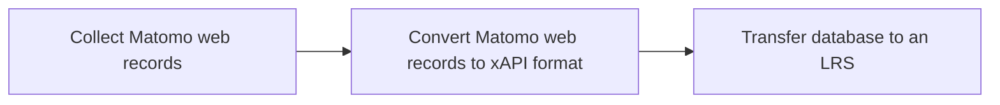
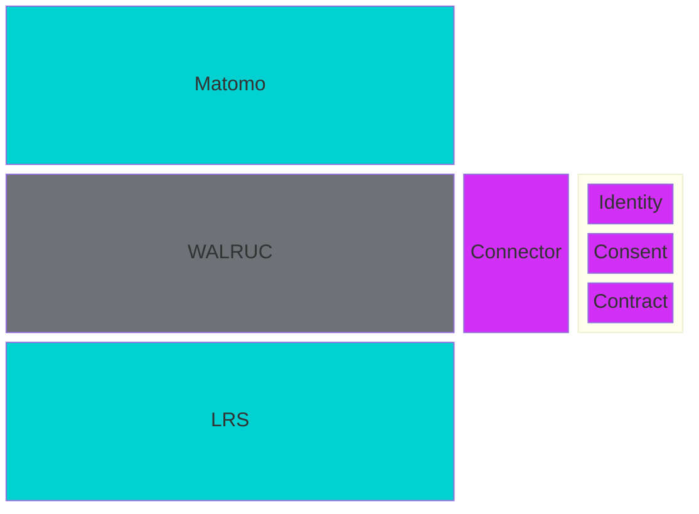
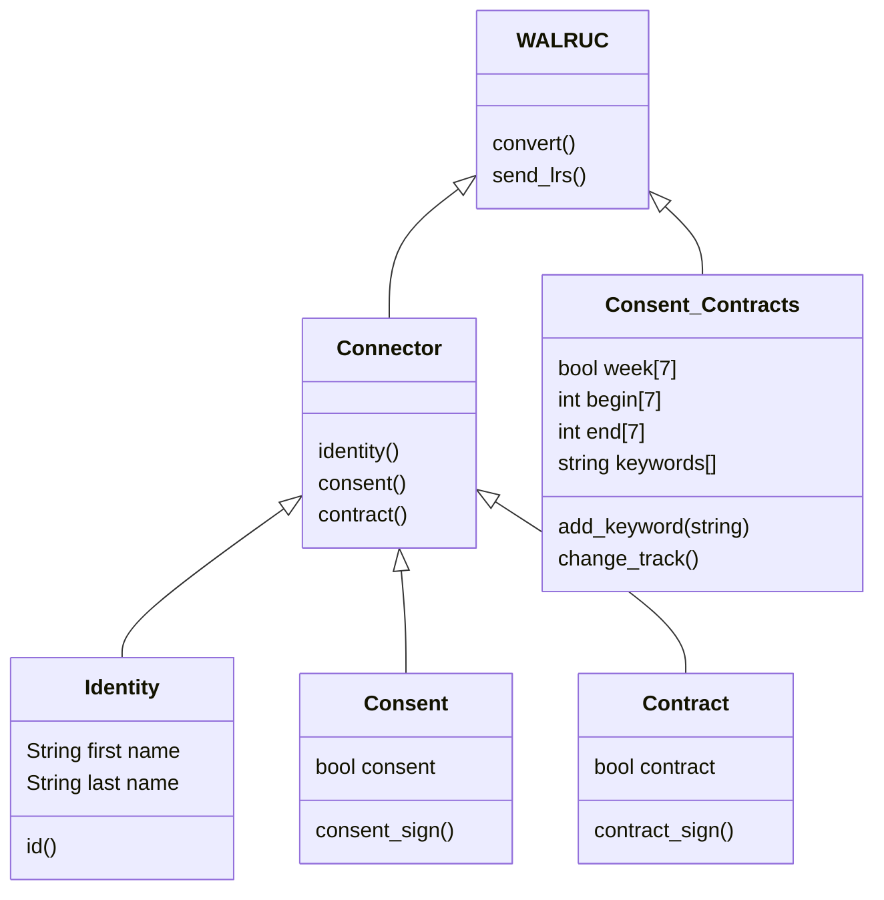
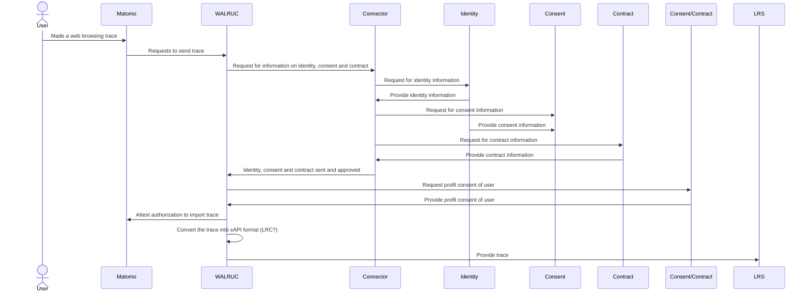

# WALRUC Design Document

Web Analytics Learning Records Universal Connector allows for the integration of web analytics data with a Learning Record Store (LRS) using the xAPI (Experience API) standard. It enables the conversion of analytics data, such as the data collected by Matomo, into an xAPI format that can be stored and tracked in a LRS.

## Technical usage scenarios & Features

*See [BB info for use cases (WP2)](https://docs.google.com/spreadsheets/d/1oKWCe0XqRJ1d-wZfKnFtZb2fS0NetFMEXX4OWSyiwDU/edit#gid=1137874968) spreadsheet.*

**Key functionalities:**

- WALRUC converts web browsing analytics data into xAPI statement

**Value-added:**

- combining web browsing data and learning records

- track the overall engagement and effectiveness of learning website

### Features/main functionalities

**Features**: 

- WALRUC converts web browsing analytics into xAPI statement \
	Path:  \
		- "Matomo sends web browsing analytics data to WALRUC" \
		- "WALRUC converts web browsing analytics into xAPI statement" \
		- "WALRUC sends xAPI statement to LRS"




### Technical usage scenarios

A training organization can use WALRUC service to track and analyze the engagement and performance of their learners on their website. Here's an example of how this could work:

1. The training organization integrates their website with a web analytics tool like Matomo, which tracks user interactions and engagement with the website.

2. The organization also sets up a Learning Record Store (LRS) like Learning Locker.

3. The WALRUC is implemented to connect the web analytics tool with the LRS. This allows the organization to convert the analytics data into an xAPI format that can be stored and tracked in the LRS.

4. As learners interact with the website, data is collected and tracked in the LRS. This includes information like pages viewed, time spent on the site, and interactions with specific content.

5. The organization can use this data to track the performance of anonymized learners (or individual learners if they have their consent) and identify areas where they may need specific or additional support or resources.

6. The organization can also use the data to track the overall engagement and effectiveness of their website, and make improvements as needed.

## Requirements

*See the [Requirements spreadsheets](https://docs.google.com/spreadsheets/d/1_woXk9aom9tDLeOff_G2cQngiwdFP7_AS2Kw-h55kgs/edit#gid=1026755951)*

| Requirement ID | Short description | BB input format | BB output format | Any other constraints | Verified by scenario | Requirement type |
|---|---|---|---|---|---|---|
| BB-REQ_ID__1 | WALRUC must request building block consent via the ARIANE connector | API call | API response |  |  |  |
| BB-REQ_ID__1.1 | Individuals must consent to the use of their web analytics data as learning records in the WALRUC of the organization | API call | API response | If the answer is no, the data cannot be used, nor transferred into or from the PLRS. If the answer is yer, the data can be used, and transferred into or from the PLRS. | BB-SC-WALRUC-01 | DEP |
| BB-REQ_ID__1.2 | Consent must be asked and verified in less than 30s | API call | API response |  | BB-SC-WALRUC-02 | PERF |
| BB-REQ_ID__2 | WALRUC must request contracts from the building block consent via the ARIANE connector | API call | API response |  |  |  |
| BB-REQ_ID__2.1 | The WALRUC must check with the contract manager through the Dataspace connector if a contract for the corresponding organization exists | API call | API response | If the answer is no, the data cannot be accessed, nor transferred into or from the PLRS. If the answer is yer, the data can be accessed, and transferred into or from the PLRS. | BB-SC-WALRUC-03 | DEP |
| BB-REQ_ID__2.2 | Contract must be asked and verified in less than 30s | API call | API response |  | BB-SC-WALRUC-04 | PERF |
| BB-REQ_ID__3 | WALRUC must connect with BB Consent/contracts negotiating agent (EDGE-Skill) |  |  |  |  |  |
| BB-REQ_ID__3.1 | BB must send the individual's consent profile when the WALRUC asks to adjust what and when they are tracked: all-time connection, only on weekends, certain keywords, etc. | API call | consent profile | Request consent 1 time, then update if the profile is modified in the corresponding building bloc. Could be asynchronous | BB-SC-WALRUC-05 | DEP |
| BB-REQ_ID__3.2 | BB must update the individual's consent profile to WALRUC when there are changes | consent profile | / | update if the profile is modified in the corresponding building bloc. Could be asynchronous | BB-SC-WALRUC-06 | DEP |

## Integrations

### Direct Integrations with Other BBs

**Interact with consent/contract**

How?

- Identify data import period (date, time, week)

- Identify keywords where we can import

- Identify sites where we can import

Why?

- transparency on data transfer

### Integrations via Connector

**Connection with connector:**

Why?

- Simplify communication between the WALRUC and PTX CCs

**Connection with contract:** 

Why?

- Contract between LRS supplier and the organization

**Connection with consent:**

Why?

- user consent to export/import his web browsing traces

What?

- Obtain user consent to export web browsing traces

- Obtain the user's consent to share web browsing traces with an LRS

**Connection with identity:**

Why?

- Enable WALRUC to use users' identities to display metadata with other

What?

- Use the user's first and last name

- Use the user's professional background

- Use the user's educational background

**Connection with LRC:**

Why?

- convert matomo data format to xAPI format

## Relevant Standards

### Data Format Standards

**Data format:**

- the data produced and/or consumed are learning records. These are logs of learning activity done by a user.

- There are several standard formats for learning records (SCORM, xAPI, cmi5, IMS caliper).

- The consensus among experts is that xAPI is the most promising standard for describing learning records.

- Inokufu have published on Prometheus-X's github a state of the art study about learning records interoperability in 2023 (see [here](https://github.com/Prometheus-X-association/learning-records-interoperability-2023)). This study describes the various formats and explains why “we" have selected xAPI as the defacto format for learning records for DASES (Dataspace of Education & Skills).

- In xAPI, each learning record is a json statement. This json contains several parts: actor, verb, object, result, context, timestamp.

- The most critical personal data are in general in the actor part. According to xAPI, one can use first name, last name or email as the actor identifier. However, in our case we always recommend using uuid to identify actors. This way our learning records are pseudonymized by default. As this won’t always be the case with other organizations connected to the dataspace.

- If shared datasets are not in xAPI format, LRC must be used to convert them to the correct format.

### Mapping to Data Space Reference Architecture Models




## Input / Output Data

**Input**** in matomo format **

WALRUC uses [matomo data format](https://developer.matomo.org/guides/log-data) as input data format.

Here is an example of Matomo logs for a user who has watched a given YouTube video on a course page of University A website.

```json

{

"date": "2024-03-11T14:17:32.814Z",

"userId": "user_123456789",

"actionType": "videoWatch",

"actionDetails": {

"pageTitle": "History Lecture Series",

"pageURL": "https://universitya.com/history-lecture-series",

"videoTitle": "What is History for?",

"videoURL": "https://www.youtube.com/watch?v=hLE-5ElGlPM",

"watchDuration": "300", // in seconds

"action": "Watched",

"videoId": "hLE-5ElGlPM"

},

"ipAddress": "192.168.1.1",

"userAgent": "Mozilla/5.0 (Windows NT 10.0; Win64; x64) AppleWebKit/537.36 (KHTML, like Gecko) Chrome/88.0.4324.150 Safari/537.36",

"siteId": "site_001",

"visitorId": "visitor_789456123"

}

```

**Output in xAPI format**

To convert the given Matomo log example into an xAPI statement, we'll map the most relevant information from the log to the appropriate xAPI fields. This involves identifying the actor (the user), the verb (the action taken), and the object (the video watched), as well as including relevant context where applicable.

```json

{

"actor": {

"objectType": "Agent",

"account": {

"homePage": "https://universitya.com/users",

"name": "user_123456789"

}

},

"verb": {

"id": "http://activitystrea.ms/schema/1.0/watch",

"display": {

"en-US": "watched"

}

},

"object": {

"id": "https://www.youtube.com/watch?v=hLE-5ElGlPM",

"definition": {

"name": {

"en-US": "What is History for?"

},

"description": {

"en-US": "A video lecture from the History Lecture Series hosted on YouTube."

},

"type": "http://activitystrea.ms/schema/1.0/video"

},

"objectType": "Activity"

},

"context": {

"platform": "Web",

"language": "en-US",

"extensions": {

"http://id.tincanapi.com/extension/ip-address": "192.168.1.1",

"http://id.tincanapi.com/extension/browser-info": "Mozilla/5.0 (Windows NT 10.0; Win64; x64) AppleWebKit/537.36 (KHTML, like Gecko) Chrome/88.0.4324.150 Safari/537.36",

"http://id.tincanapi.com/extension/page-url": "https://universitya.com/history-lecture-series",

"http://id.tincanapi.com/extension/duration": "PT300S"

}

},

"timestamp": "2024-03-11T14:17:32.814Z",

"authority": {

"objectType": "Agent",

"name": "University A LOMCT",

"mbox": "mailto:contact@universitya.com"

},

"stored": "2024-03-11T14:17:43.686Z",

"version": "1.0.0"

}

```

Architecture


Dynamic Behaviour
WALRUC building blocks communicate with other building blocks, in a precise order.


## Configuration and deployment settings

**Installation and deployment**** :**

- Install Matomo on a server

- Install WALRUC plugin on Matomo

- Connect a website to Matomo

- Install a LRS

- Add LRS url and credential into WALRUC settings

## Third Party Components & Licenses

*See the "**[EDGE third party/background components](https://docs.google.com/spreadsheets/d/13Lf4PfVnA_lAk-7dMeIy0QRxHnarxMcsS8EaLjyOlBA/edit#gid=1385858520)**" spreadsheet.*

**External components and licenses :**

- Matomo, [open source](https://github.com/matomo-org/matomo), [license ](https://fr.matomo.org/licences/)[GPLv3](https://fr.matomo.org/licences/)

- Pydantic, [open source](https://github.com/pydantic/pydantic), [license MIT](https://github.com/pydantic/pydantic?tab=MIT-1-ov-file#readme)

## Implementation Details

*This is optional: remove this heading if not needed.*

*You can add details about implementation plans and lower-level design here.*

## OpenAPI Specification

*In the future: link your OpenAPI spec here.*

```yml
openapi: 3.0.0 \
info: \
     version: 0.0.1 \
     title: Web Analytics Learning Records Universal Connector \
   description: Web Analytics Learning Records Universal Connector allows for the integration of web analytics data with a Learning Record Store (LRS) using the xAPI (Experience API) standard. It enables the conversion of web analytics data, such as the data collected by Matomo, into an xAPI format that can be stored in a LRS. \
paths: \
     /list: \
          get: \
               description: Returns a list of stuff \
                    responses: \
                         '200': \
                              description: Successful response

```

## Test specification

*Test definitions and testing environment should be availaible, and the tests should be repeatable.*

### Test plan

*Testing strategy, tools and methods chosen, methods for acceptance criteria.*

*[To be detailed](https://drive.google.com/drive/folders/1gId01K0uelxkqrO0yAgiysT3jrTi5foj)**.*

Before putting V0 into the hands of users, we need to make sure that WALRUC works in a number of applications. We'll need to test it at least on our Becomino website which is equipped with Matomo and a LRS (Learning Locker). The tests will be conclusive if we see the matomo logs correctly converted into valid xAPI statements in the LRS.

### Unit tests

*Here specify the test cases for the components inside the BB.*  

*Candidates for tools that can be used to implement the test cases: JUnit, Mockito, Pytest.*

### Integration tests

*Here specify how to test the integration of the components inside the BB.*

*Candidates for tools that can be used to implement the test cases: K6, Postman, stepci, Pact*

*An example tutorial is available [here](https://github.com/ftsrg-edu/swsv-labs/wiki/2b-Integration-testing).*

### UI test (where relevant)

*Candidates for tools that can be used to implement the test cases: Selenium* 
